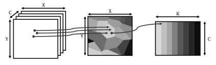

# superpixPool
Superpixel Pooling implemented in PyTorch and Chainer

This code is the product of a Masters thesis done by Mathijs Schuurmans under supervision by Maxim Berman and Matthew Blaschko, at the center for processing speech and images, Dept. of Electrical Engineering, KU Leuven. It includes CUDA implementation of superpixel pooling with integration in the Chainer and PyTorch deep learning framworks. 

Experimental details related to this work are given in [https://arxiv.org/abs/1806.02705](https://arxiv.org/abs/1806.02705). Please cite that article if you use this code in your research.

At the moment the chainer version implements a 3d pooling layer, and the pytorch version a 2d pooling layer. See the PyTorch and Chainer subfolders for implementation of the pooling layer in these respective frameworks.

